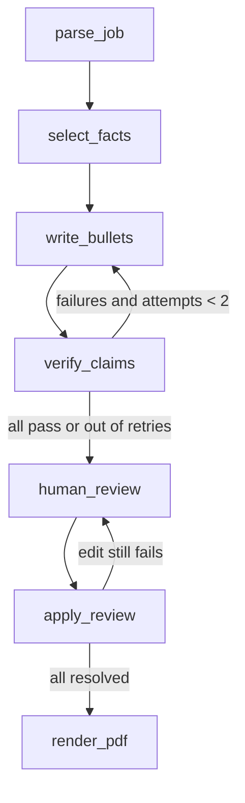

# jobpilot

Paste a job posting, get a tailored resume where **every bullet is traceable
to something you actually did** — and anything that isn't gets blocked before
you ever see it.


## The problem

Ask an LLM to tailor your resume to a job and it will happily improve your
numbers. "Led a team of 3" becomes "led a team of 12"; a tool you've never
touched appears in your skills because the posting asked for it. That's not a
prompt-engineering problem you can fix with "please don't lie" — it's a
verification problem.

jobpilot treats the model as a *writer* and adds a separate *fact-checker*.
The writer may phrase a bullet any way it likes, but every claim needs a
source on file, and the fact-checker runs before a human ever reads it.

## How the verification works

Two layers, cheapest first:

1. **Deterministic checks** (`src/jobpilot/verify/checks.py`) — no LLM, no
   cost, no opinion. Does every cited fact ID exist? Does every number in the
   bullet appear in the cited evidence? Does every recognised skill it
   mentions appear in the cited facts? These catch the bulk of fabrications
   outright, and can't be talked out of it.
2. **An LLM judge** (`src/jobpilot/verify/judge.py`) — runs *only* on bullets
   that already passed layer 1, and only handles what regexes can't: inflated
   scope, implied ownership, invented outcomes.

A bullet that fails goes back to the writer with its specific failures
attached, up to two retries. Whatever still fails is shown to you clearly
marked, never silently dropped or silently kept.

> One real bug this design caught in review: the number check originally
> compared substrings, so a bullet claiming "a team of **5**" passed against
> evidence of "**50**". Now it compares whole number tokens.
> See `docs/decisions/0003`.

## Architecture



FastAPI owns all state. The review step is a real LangGraph `interrupt()`
backed by a Postgres checkpoint, so a run can sit paused for days and resume
exactly where it stopped — including across an API restart. Full write-up in
[docs/architecture.md](docs/architecture.md).

## Quickstart

```bash
cp .env.example .env          # add GOOGLE_API_KEY
make up                       # Postgres via docker compose
make migrate                  # alembic upgrade head
cp profile/profile.example.yaml profile/profile.yaml   # or write your own
uv run jobpilot profile import profile/profile.yaml
make dev                      # API + HTMX review UI on :8000
```

Then either drive it from the API:

```bash
curl -X POST localhost:8000/jobs -H 'content-type: application/json' \
     -d '{"text": "<paste a job posting>"}'
curl -X POST localhost:8000/jobs/<job_id>/tailor      # 202 + run_id
open localhost:8000/runs/<run_id>/page                # review each bullet
```

…or entirely from the terminal:

```bash
uv run jobpilot tailor <job_id>     # prompts for accept/edit/reject inline
uv run jobpilot watch               # sweep saved boards for new high-fit roles
```

## Commands

| Command | What it does |
|---|---|
| `make dev` / `test` / `lint` / `eval` | Run the API, the fast tests, linting, the eval suite |
| `make up` / `down` / `migrate` | Postgres lifecycle and schema |
| `jobpilot profile import <yaml>` | Load your facts; fails loudly on duplicate IDs |
| `jobpilot tailor <job_id>` | Full tailoring run with inline review |
| `jobpilot watch` | Fetch saved Greenhouse/Lever boards, list new high-coverage roles |

## Results

Generated by `make eval` — never typed by hand. The table below is empty
because **this suite has not been run yet**: it needs a real API key, which
wasn't available in the environment this was built in. Running `make eval`
fills it in and rewrites this section in place.

<!-- eval-results:start -->
| Metric | Value | Model | Dataset | Trials | Date |
|--------|-------|-------|---------|--------|------|
<!-- eval-results:end -->

The eval set is real: 25 live job postings pulled from public Greenhouse
board APIs and frozen as text files (with source URL and fetch date) so
scores don't drift when a company edits a posting, plus a 120-case verifier
set — 40 truthful claims and 80 seeded fabrications, split evenly across
changed numbers, added tools, inflated scope, and invented outcomes.

## Project status

| Area | State |
|---|---|
| Ingestion, tailoring graph, verifier, CLI | Built, 45 tests passing |
| Human review, PDF export, fit scoring, tracker | Built |
| Eval harness + datasets | Built; **not yet run** (needs an API key) |
| Postgres-backed tests | Written; **not yet run** (needs Docker) |
| Demo GIF | Not recorded |

Tagged `v0.1.0` at MVP and `v1.0.0` at feature-complete.

## Design decisions

Short write-ups of the calls that had a real alternative:

- [Why checks run before the human sees anything](docs/decisions/0002-checks-before-human.md)
- [Why deterministic checks run before the LLM judge](docs/decisions/0003-deterministic-before-judge.md)
- [How the fit score is weighted](docs/decisions/0001-fit-score-weighting.md)

## Safety and limitations

- **Submitting is always manual.** Nothing auto-applies to a job.
- **No scraping.** Postings come from public Greenhouse/Lever APIs or paste.
- Your real profile lives in `profile/profile.yaml`, which is gitignored.
  The committed `profile.example.yaml` is a fictional candidate.
- The verifier cannot catch a fabrication that happens to reuse vocabulary
  already in your profile — it checks provenance, not plausibility.
- Skill checking uses a fixed vocabulary (`domain/skills.py`); a skill outside
  it falls through to the LLM judge rather than the deterministic layer.

## License

MIT
