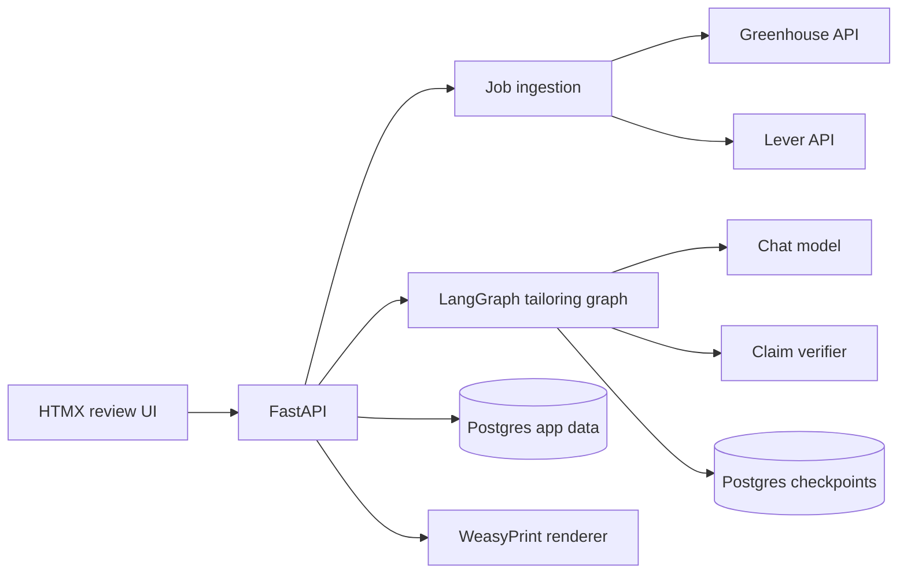
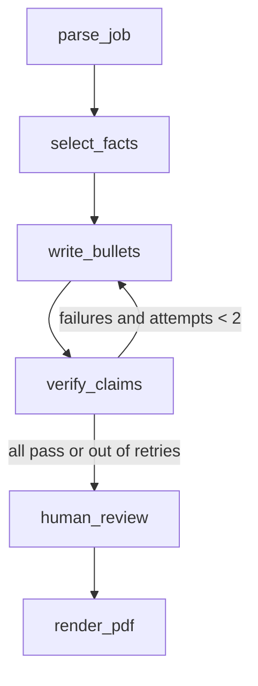

# Architecture

FastAPI owns all state. The tailoring graph pauses at human review using a
Postgres checkpoint, so a review can wait for days and resume exactly where
it stopped.

## Tailoring graph

Mental model: the verifier is a newspaper fact-checker. The writer may phrase
a claim any way it likes, but every claim needs a source on file.
